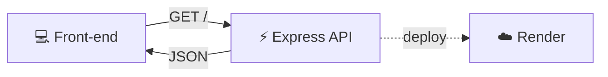
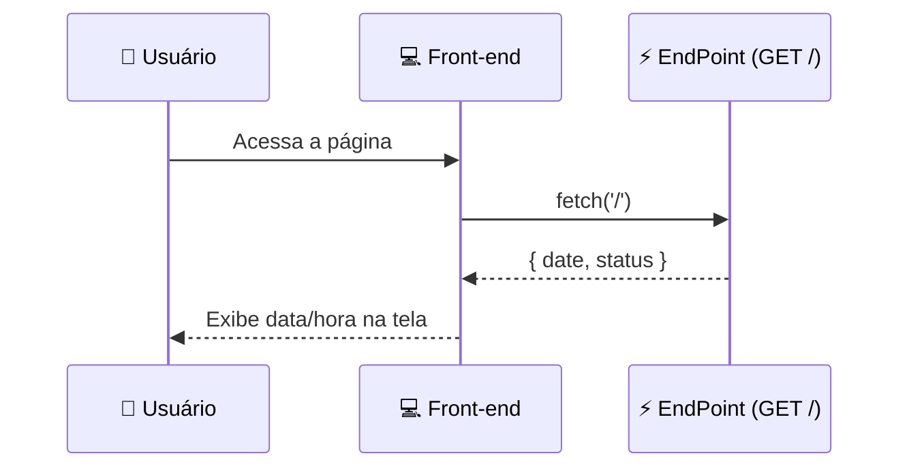

# 🎯 Criando um EndPoint com Express


Projeto de exemplo criando um **endpoint de API REST** que retorna a **data e hora atuais**, para ser consumido por uma aplicação front-end.

---

## 📑 Índice

1. [O que é um EndPoint](#-o-que-é-um-endpoint)
2. [Arquitetura do projeto](#-arquitetura-do-projeto)
3. [Pré-requisitos](#-pré-requisitos)
4. [Instalação](#-instalação)
5. [Criando o EndPoint](#-criando-o-endpoint)
6. [Testando o EndPoint](#-testando-o-endpoint)
7. [Fluxo da requisição](#-fluxo-da-requisição)
8. [Deploy no Render](#-deploy-no-render)
9. [Consumindo no Front-end](#-consumindo-no-front-end)
10. [Checklist da atividade](#-checklist-da-atividade)
11. [Estrutura de pastas](#-estrutura-de-pastas)

---

## 🧩 O que é um EndPoint

> [!NOTE]
> Um **endpoint** é uma URL específica que fornece acesso a um recurso ou funcionalidade de uma API. Representa o ponto de comunicação entre o cliente e o servidor.

Neste projeto, o endpoint criado é:

```text
GET /
```

Ele retorna a **data/hora atual** e um status confirmando que a API está no ar.

---

## 🏗️ Arquitetura do projeto



---

## ⚙️ Pré-requisitos

- [x] [Node.js](https://nodejs.org/) instalado (v18+)
- [x] [Git](https://git-scm.com/) instalado
- [x] Conta no [GitHub](https://github.com)
- [x] Conta no [Render](https://render.com)

---

## 📦 Instalação

```bash
# 1. Crie a pasta do projeto
mkdir minha-api && cd minha-api

# 2. Inicialize o projeto
npm init -y

# 3. Instale o Express
npm install express

# 4. Instale o CORS
npm install cors
```

---

## 🛠️ Criando o EndPoint

Crie o arquivo `api.js`:

```javascript
import express from 'express';
import cors from 'cors';

const app = express();
app.use(cors());

// 🎯 EndPoint principal — retorna data e hora
app.get('/', (req, res) => {
  res.json({
    date: new Date().toLocaleString('pt-BR'),
    status: 'API no Render funcionando!'
  });
});

// Porta dinâmica (necessária para o Render)
const PORT = process.env.PORT || 3000;
app.listen(PORT, () => {
  console.log(`🚀 Servidor rodando na porta ${PORT}`);
});
```

> [!WARNING]
> O **CORS** é obrigatório aqui: sem ele, o navegador bloqueia requisições vindas de um domínio diferente (ex: seu front-end tentando acessar a API).

<details>
<summary>📄 Ver <code>package.json</code> configurado</summary>

```json
{
  "name": "minha-api",
  "version": "1.0.0",
  "type": "module",
  "main": "api.js",
  "scripts": {
    "start": "node api.js"
  },
  "dependencies": {
    "cors": "^2.8.5",
    "express": "^4.19.2"
  }
}
```

</details>

---

## ▶️ Testando o EndPoint

```bash
node api.js
```

Acesse no navegador ou via `curl`:

```bash
curl http://localhost:3000/
```

**Resposta esperada:**

```json
{
  "date": "26/08/2026 22:10:45",
  "status": "API no Render funcionando!"
}
```

---

## 🔀 Fluxo da requisição



---

## ☁️ Deploy no Render

| Passo | Ação |
|---|---|
| 1️⃣ | Faça commit do projeto em um repositório no GitHub |
| 2️⃣ | Acesse [dashboard.render.com](https://dashboard.render.com) |
| 3️⃣ | Clique em **New → Web Service** e conecte o repositório |
| 4️⃣ | **Build Command:** `npm install` |
| 5️⃣ | **Start Command:** `node api.js` |
| 6️⃣ | Após o deploy, acesse `https://seu-projeto.onrender.com` |

---

## 🌐 Consumindo no Front-end

```javascript
fetch('https://seu-projeto.onrender.com/')
  .then(res => res.json())
  .then(data => {
    document.getElementById('data-hora').innerText = data.date;
  })
  .catch(err => console.error('Erro ao consumir o endpoint:', err));
```

---

## ✅ Checklist da atividade

- [x] Criar API com Express
- [x] Definir rota de consulta de data/hora
- [ ] Fazer deploy no Render
- [ ] Criar front-end que consuma a API
- [ ] Documentar com prints do código e da aplicação funcionando
- [ ] Separar API e front-end em repositórios diferentes
- [ ] Enviar links dos repositórios via Canva

---

## 📂 Estrutura de pastas

```bash
minha-api/
├── api.js              # EndPoint principal (Express)
├── package.json        # Dependências e scripts
├── .gitignore           # node_modules, .env, etc.
└── README.md            # Este arquivo
```

---

🎓 *Projeto desenvolvido para a disciplina Frameworks Front-end — SENAI, sob orientação do Prof. Me. Deivison S. Takatu.*
